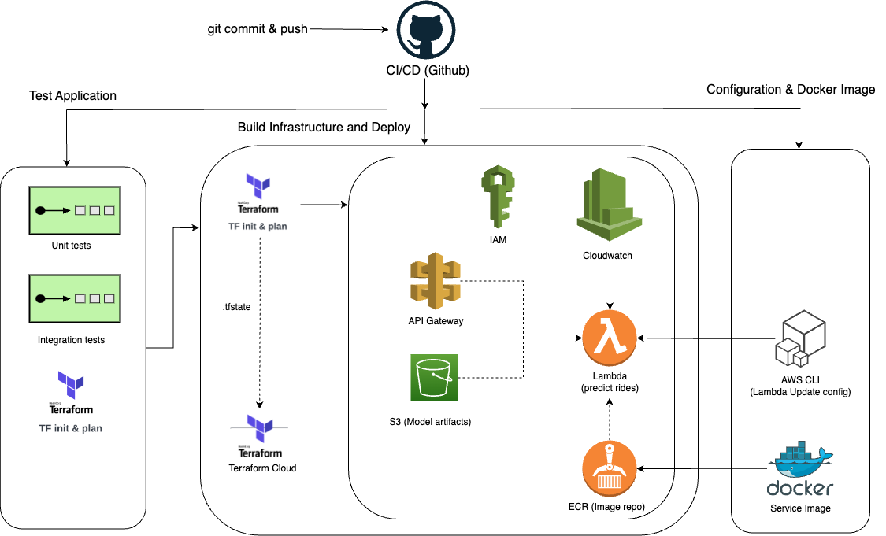
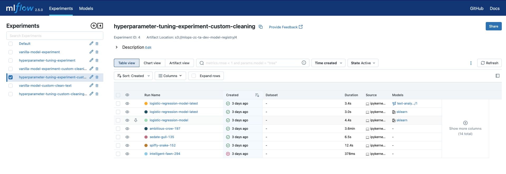
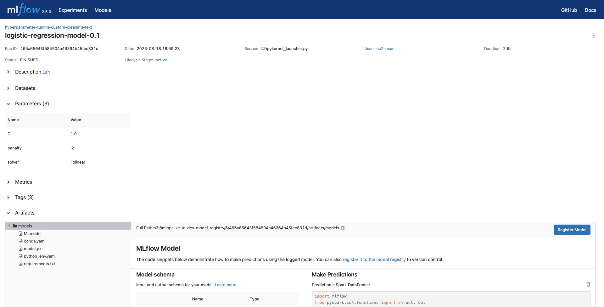
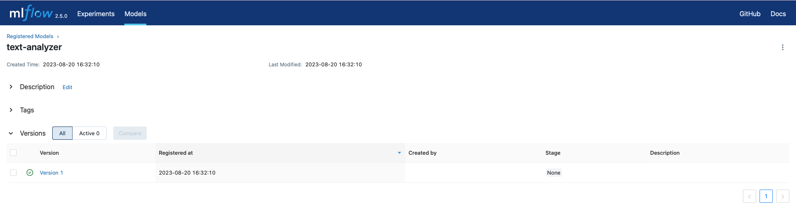
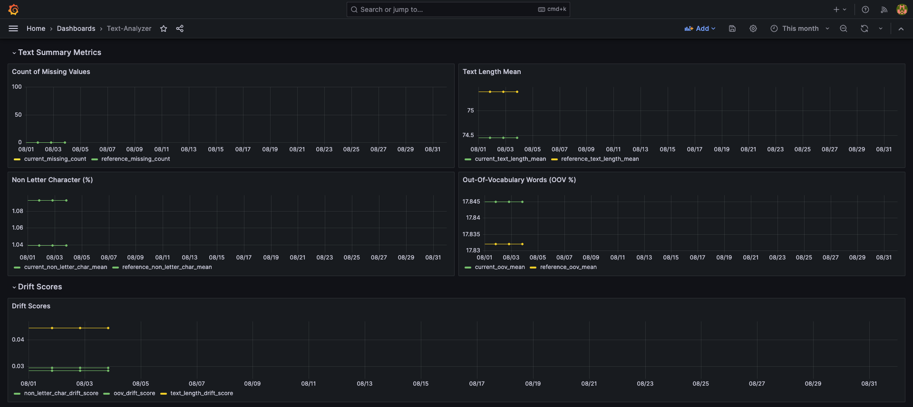
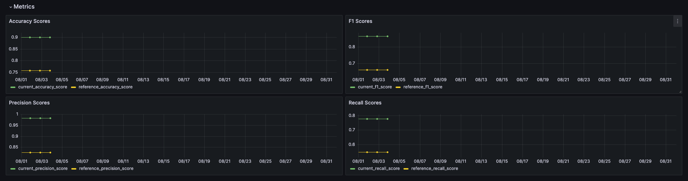
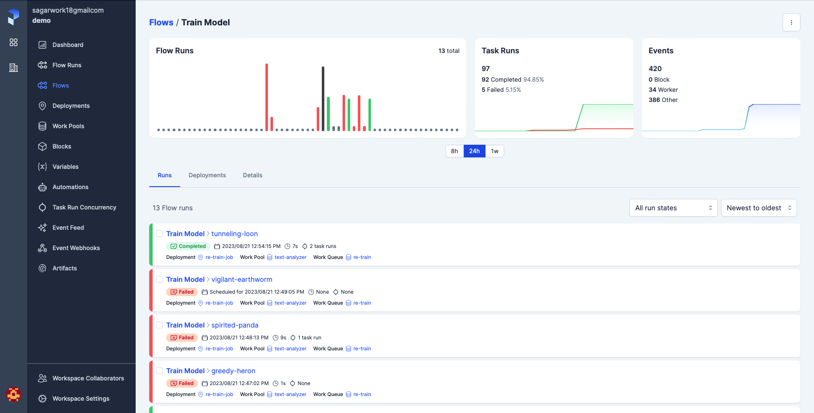
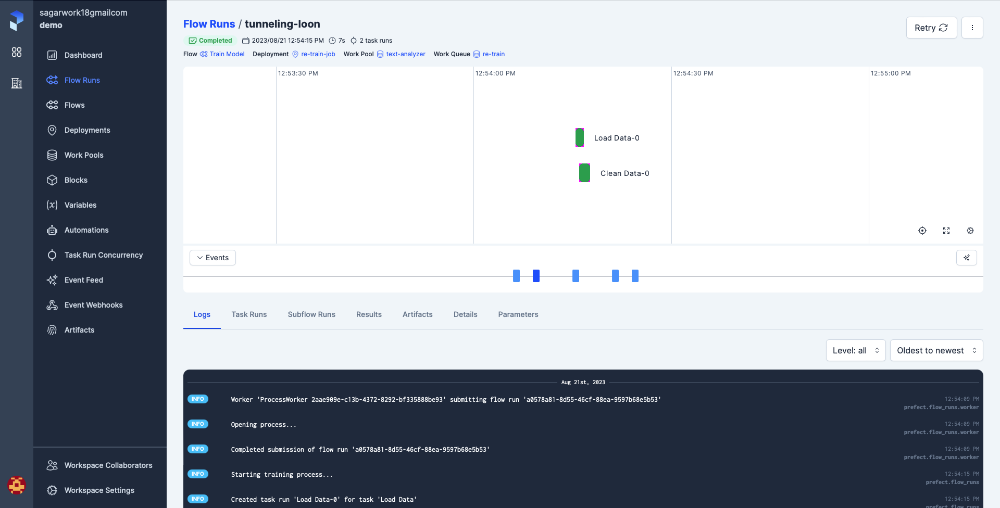
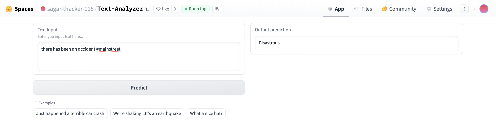

# Text Analyzer

This project is a part of the [MLOps Zoomcamp](https://github.com/DataTalksClub/mlops-zoomcamp/tree/main) Project. The aim of the project is to build an end-to-end mlops pipeline.

## Table of Content

- [Problem Statement](#problem-statement)
- [Pre-requisites](#pre-requisites)
- [Project Directory Structure](#project-directory-structure)
- [Infrastructure](#infrastructure)
- [Setup EC2](#setup-ec2)
- [Exploratory Data Analysis and Modeling](#exploratory-data-analysis-and-modeling)
- [Deployment](#deployment)
- [Model Monitoring](#model-monitoring)
- [Retraining](#retraining)
- [CI/CD Pipline](#ci-cd-pipeline)
- [Best Practices](#best-practices)
- [Tests](#tests)
- [User Interface](#user-interface)


## Problem Statement

Social Media Texts have been used extensively to understand various events and their impact on the society. In this project we will build a text analyzer that will be able to classify social media text into two categories: `Disastrous` and `Non-Disastrous`. The model is trained on a kaggle dataset from "[Natural Language Processing with Disaster Tweets Competition](https://www.kaggle.com/competitions/nlp-getting-started)".

Classifying tweets as related to natural disasters or not can be valuable for several reasons:

- Early Detection and Response: Social media platforms like Twitter are often used to share real-time information during natural disasters. By classifying tweets, emergency response teams and authorities can quickly identify emerging situations and allocate resources more effectively.

- Situational Awareness: Monitoring tweets can provide insights into the scope, intensity, and impact of a natural disaster. This information can aid in understanding the situation on the ground and making informed decisions.

- Public Safety Alerts: During natural disasters, authorities can use Twitter to send alerts and warnings to affected populations. Accurate classification ensures that relevant alerts reach the right people.

- Resource Allocation: By analyzing tweets, organizations can understand the needs of affected communities and allocate resources such as food, water, medical supplies, and shelter accordingly.

- Disaster Recovery: After a disaster, tweets can provide insights into the ongoing recovery efforts, the needs of survivors, and areas that require additional support.

## Pre-requisites

The following tools are required to run the project:

- [AWS CLI](https://docs.aws.amazon.com/cli/latest/userguide/cli-chap-install.html)
- [Terraform](https://learn.hashicorp.com/tutorials/terraform/install-cli)
- [Docker](https://docs.docker.com/get-docker/)
- [Python](https://www.python.org/downloads/)

You will also need an AWS account, Terraform Cloud account, and Prefect Cloud account.

To setup the AWS CLI you'll need to create a IAM user with the following permissions: `AmazonAPIGatewayAdministrator`, `AmazonEC2FullAccess`, `AmazonRDSFullAccess`, `AmazonS3FullAccess`, `AWSLambda_FullAccess`, `CloudWatchFullAccess`, `IAMFullAccess`, `NetworkAdministrator`. Also create and attach a policy which give full access to ECR.

This user acts as the admin for the project and will be used to create the infrastructure. However when the infrastructure is created each service will have its own IAM role with the least required permissions.

Next, you'll need to create an access key for the user. This will give you the `AWS_ACCESS_KEY` and `AWS_SECRET_ACCESS_KEY` which you'll need to configure the AWS CLI. You can configure the AWS CLI using the command `aws configure`. You'll need to provide the `AWS_ACCESS_KEY` and `AWS_SECRET_ACCESS_KEY` along with the `AWS_REGION` and `AWS_OUTPUT_FORMAT`.

Create AWS EC2 key pair and download the `.pem` file. This will be used to ssh into the EC2 instance. Follow the instructions [here](https://docs.aws.amazon.com/AWSEC2/latest/UserGuide/create-key-pairs.html#having-ec2-create-your-key-pair) to create the key pair. Save the `.pem` file in the `~/.ssh` directory.

In the file `terraform/moddules/ec2_rds/variables.tf` update the `key_name` variable with the name of the key pair you created at `line 44`.

In the ~/.ssh/config file add the following lines:

```bash
Host ec2
    HostName <ec2_public_ip>
    User ec2-user
    IdentityFile ~/.ssh/<key_pair_name>.pem
```

## Project Directory Structure

There are some files that might be missing from the github directory structure but are created for development purpose and are not pushed to github. These files are:
`workflow.secrets`, `workflow.vars`, and `secrets.tfvars` in the `.github/workflows` directory.

```bash
.
├── .github
│   ├── workflows
│   └── workflow.secrets
│   └── workflow.vars
├── Makefile
├── Pipfile
├── Pipfile.lock
├── README.md
├── data
│   ├── raw
│   └── submission.csv
├── deployment
│   ├── Dockerfile
│   ├── Pipfile
│   ├── Pipfile.lock
│   └── app
├── gradio-app
│   └── app.py
├── monitoring
│   ├── config
│   ├── dashboards
│   ├── data
│   ├── docker-compose.yaml
│   ├── evidently_grafana_metrics.py
│   ├── models
│   └── notebooks
├── notebooks
│   ├── exploratory-data-analysis.ipynb
│   └── modeling.ipynb
├── prefect.yaml
├── pyproject.toml
├── terraform
│   ├── main.tf
│   ├── modules
│   ├── outputs.tf
│   └── variables.tf
├── tests
│   ├── integration_tests
│   └── unit_tests
└── training
    ├── prefect.yaml
    ├── re-train.py
    └── utils
```

## Infrastructure



The project is deployed on AWS using the following services:

- [AWS S3](https://aws.amazon.com/s3/) for storing the data and model artifacts.
- [AWS RDS](https://aws.amazon.com/rds/) as the MLflow tracking server.
- [AWS Lambda](https://aws.amazon.com/lambda/) for running the inference code.
- [AWS API Gateway](https://aws.amazon.com/api-gateway/) for creating the API endpoint.
- [AWS ECR](https://aws.amazon.com/ecr/) for storing the docker image.
- [AWS EC2](https://aws.amazon.com/ec2/) for building the project.
- [AWS IAM](https://aws.amazon.com/iam/) for managing the permissions.

The infrastructure is managed using Terraform. The Terraform code is located in the `terraform` directory.

Below are some terraform cloud comamnds:
* Login to Terraform Cloud: `terraform login`
* Create new workspace: `terraform workspace new <workspace_name>`
* Select workspace: `terraform workspace select <workspace_name>`
* List workspaces: `terraform workspace list`
* Delete workspace: `terraform workspace delete <workspace_name>`
* Show workspace: `terraform workspace show`

### Steps to deploy the infrastructure:
1. Open terminal or command prompt and move to the `terraform` directory.
2. Login to Terraform Cloud using the command `terraform login`.
1. Create three workspaces: `dev`, `staging`, and `prod`. Examples: `terraform workspace new dev`. We'll work in the `dev` workspace.
4. For each workspace in the terraform cloud, change the `Execution Mode` to `Local`.
    - Open the browser and go to the terraform cloud.
    - Select the workspace, Click on `Settings`.
    - In `General` tab, change the `Execution Mode` to `Local`, and click on `Save Settings`.
5. In the `terraform/modules/vars` directory create a file `secrets.tfvars` that will contain the following values:
    - `aws_access_key` = `<AWS_ACCESS_KEY>`
    - `aws_secret_key` = `<AWS_SECRET_ACCESS_KEY>`
    - `db_username` = `<DB_USERNAME>` # RDS postgres username
    - `db_password` = `<DB_PASSWORD>` # RDS postgres password
5. In the terminal or command prompt, run the command `terraform init`.
6. Terraform plan: `terraform plan -var-file="./modules/vars/dev.tfvars" -var-file="./modules/vars/secrets.tfvars"`
7. Terraform apply: `terraform apply -var-file="./modules/vars/dev.tfvars" -var-file="./modules/vars/secrets.tfvars"`
8. Terraform destroy: `terraform destroy -var-file="./modules/vars/dev.tfvars" -var-file="./modules/vars/secrets.tfvars"`

## Setup EC2

We'll move to EC2 instance to work on the rest of the project. You can connect to the EC2 instance using the using VS Code Remote SSH extension or following command:

```bash
ssh ec2-user@ec2
```

- Git clone the project on the EC2 instance using the `git clone` command.

- Make sure `make` is installed on the EC2 instance. If not, install it using the following command:

```bash
sudo yum install make
sudo yum install git # Also install git if not installed
```
```

### Install all the tools and dependencies

```bash
make install-software
make setup
```

## Exploratory Data Analysis and Modeling

The exploratory data analysis and modeling is done in the `notebooks` directory. The exploratory data analysis is done in the `exploratory-data-analysis.ipynb` notebook. The modeling is done in the `modeling.ipynb` notebook.

### Setup the environment

The project root folder contains the `Pipfile` and `Pipfile.lock` files. The `Pipfile` contains the list of all the dependencies. The `Pipfile.lock` contains the exact versions of the dependencies. The `Pipfile` and `Pipfile.lock` files are used by the `pipenv` tool to create a virtual environment and install all the dependencies.

To create a virtual environment and install all the dependencies, run the following command:

```bash
pipenv install
```

To activate the virtual environment, run the following command:

```bash
pipenv shell
```

### MLflow Tracking

The MLflow tracking server is deployed on AWS RDS. The MLflow tracking server is used to track the model training runs. Also, MLflow artifacts are stored on AWS S3.

To start the MLflow tracking server, run the following command:

```bash
mlflow server -h 0.0.0.0 -p 5000 --backend-store-uri postgresql://DB_USER:DB_PASSWORD@DB_ENDPOINT:5432/DB_NAME --default-artifact-root s3://S3_BUCKET_NAME
```

You can find the DB_USER and DB_PASSWORD in the `secrets.tfvars` file. You can find the DB_ENDPOINT on the AWS RDS console. ENDPOINT format would be `<DB_NAME>.<RANDOM_STRING>.<REGION>.rds.amazonaws.com`. You can find the DB_NAME on the AWS RDS console.

Note: Add port 5000 for port forwarding in VS Code.

Below you can find the MLflow UI screenshot of the model training runs:



MLflow Logged Model:

You can view in the below image that the model is logged in the S3 bucket.



MLflow Model Registry:



## Deployment

The deployment is done using AWS Lambda and AWS API Gateway. We deploy the docker image to AWS ECR which is used by the AWS Lambda function. The AWS Lambda function is invoked by the AWS API Gateway endpoint.

To deploy our model, we'll need to convert our notebooks to python scripts. Also, create python environment file `Pipfile` and `Pipfile.lock` with all the dependencies. Then we'll create a docker image and push it to AWS ECR.

All the deployment related code is located in the `deployment` directory.

Following best practices for deploying machine learning models, we don't have to manually create the image and push it to AWS ECR. We'll use the CI/CD pipeline to automate the deployment process. More on this later.

## Model Monitoring

Till now what all we performed was on the cloud infrastructure. However, the current and the next section will be performed on the EC2 instance locally.

Due to the time constraint, I was not able to automate the model monitoring process. However, I have written the code for model monitoring. The code is located in the `monitoring` directory.

We'll be using `Evidently` library for model monitoring. Evidently is an open-source Python library to monitor machine learning models. It provides interactive reports to monitor the behavior of your model over time. It also provides a set of metrics to detect model performance drift and data drift.

To keep track of the model performance and data drift, we'll build a dashboard using `Grafana`.

The idea behind model monitoring is that we have already trained a model on the training data. However, over time new data will be generated. We'll use the new data to monitor the model performance and data drift. If the model performance and data drift are not within the threshold, we'll retrain the model.

In evidently `referenced data` is the data that was used to train the model. The `current data` is the new data that is generated over time. The current data is used to monitor the model performance and data drift.

To view the model monitoring dashboard, run the following command:

```bash
docker-compose up
```

You can view the dashboard on the following URL:

```bash
http://localhost:3000
```

Note: Allow port 3000 for port forwarding in VS Code.

If you come across an error `Error bind: address already in use`, run the following command:

```bash
sudo ss -lptn 'sport = :5432'
sudo kill <PID>
```

The dashboard will look like the following:

I have created three categories of metrics to monitor: `Text Summary Metrics`, `Data Drifts` and `Metrics`.

Text Summary Metrics:

- It provides summary metrics on the textual data such as `Number of  Missing values`, `Mean text length`, `Out of vocabulary words %` and `Non-letter characters %`.

Data Drifts:

- Similar to above metrics, it checks data drifts for `Text Length`, `Out of vocabulary words` and `Non-letter characters`.



Metrics:

- It provides metrics such as `Accuracy`, `Precision`, `Recall`, and `F1 Score`.



## Retraining

The idea behind retraining is that when the model performance degrades or the data drift is not within the threshold, we'll retrain the model. We'll use the new data to retrain the model.

The retraining code is located in the `training` directory.

As the project is not live and we don't have new data, I have written the code to retrain the model on the training data. However there are placeholders where you can change the path to the new data.

To retrain the model, run the following command:

```bash
python re-train.py
```

### Re-training Workflow using Prefect

Ideally we should automate the re-training process. We'll use `Prefect` to automate the re-training process. Prefect is a workflow management system that makes it easy to build, run, and monitor data workflows.

We have wrapped our re-training code in a Prefect flow and deployed it to Prefect Cloud. We can schedule the flow to run at a specific time interval or we overshoot the threshold.

To create a Prefect deployment you would need to update the `repository` value in the `prefect.yaml` file to your repository.

In your prefect cloud account create a work pool with the following configuration:

1. Sign in to your Prefect Cloud account.
2. Click on the `Workflows` tab.
3. Click on the `+` icon to create a new work pool.
4. Select `Local Subprocess` as the Infrastructure Type.
5. Click on `Next`, enter the name of the work pool and click on `Create`.

Create a Work-Queue in the same work-pool with the following configuration:

1. Click on the `WorkQueues` tab.
2. Click on the `+` icon to create a new work queue.
3. Enter the name of the work queue and click on `Create`.

Run the following command:

```bash
# Login to prefect cloud
prefect cloud login

# Deploy the flow to prefect cloud
prefect deploy --name re-train-job
```

To answer the question:
- Select flow_name: start_training
- Select work_pool_name: text-analyzer
- Is <github-url/username/text-analyzer> the correct URL to pull your flow code from? [y/n] (y): y
- Is feature the correct branch to pull your flow code from? [y/n] (y): n
- Please enter the branch to pull your flow code from (main): main
- Is this a private repository? [y/n]: n
- Would you like to save configuration for this deployment for faster deployments in the future? [y/n]: y

```bash
# Start the worker
prefect worker start --pool text-analyzer --work-queue re-train

# Run the deployment
prefect deployment run 'Train Model/re-train-job'
```

Below is the screenshot of the Prefect Deployment:





## CI-CD Pipeline

Working on a project usually involves multiple environments such as development, staging, and production. To replicate this practice in our project, we'll create environments in github. We'll create three environments: `dev`, `stg`, and `prod`.

You can do this by going to the `Settings` tab in your repository and then clicking on `Environments`.

Since we are using CI/CD pipelines to deploy our application in different environments we'll create Github Secrets and Variables to store the credentials and other information.

Create Repository Secrets with the following names and appropriate values based on your configuration:
- `AWS_ACCESS_KEY_ID`: AWS Access Key ID
- `AWS_DEFAULT_REGION`: AWS Default Region
- `AWS_SECRET_ACCESS_KEY`: AWS Secret Access Key
- `EXPERIMENT_ID`: MLflow Experiment ID
- `RUN_ID`: MLflow Run ID
- `GH_TOKEN`: Github Token
- `TF_API_TOKEN`: Tensorflow API Token

Create Environment level secrets and variables with the following names and values based on your configuration:

Each environment will have the following secrets and variables:

Secrets:
- `DB_PASSWORD`: Database Password
- `DB_USERNAME`: Database Username

Variable:
- `TF_WORKSPACE`: `dev` or `stg` or `prod` for respective environments

Additionally, the staging and production environment will have the following secrets:

Staging:
- `DEV_MODEL_REGISTRY`: 'mlops-zc-ta-dev-model-registry'

Production:
- `STG_MODEL_REGISTRY`: 'mlops-zc-ta-stg-model-registry'

This is used to take sync the model from the development/staging environment and deploy it to the staging/production environment.

### Github Actions

Always use a separate branch for development and push the changes to the `feature` branch. `feature` branch is used for development and testing.

If the functionality is working as expected, pipeline automatically pushes the changes to the `staging` branch where the changes are tested in the staging environment.

If the functionality is working as expected in the staging environment, pipeline automatically create a pull request to the `main` branch where the changes are required to be merged manually.

Once the changes are merged to the `main` branch, pipeline automatically deployes the application to the production environment.

While working on the project, I found a great tool called `act` which allows you to run your GitHub Actions locally. This is a great tool to test your GitHub Actions locally before pushing the changes to the repository. Check out the repository [here](https://github.com/nektos/act)

## Best Practices

Following the best practices of software development, I have created a `Makefile` to automate the quality checks and other tasks.

Quality Checks includes the following:
- `black`: Code Formatter
- `pylint`: Code Linter
- `isort`: Import Sorter
- `trailingspaces`: Trailing Whitespace Remover
- `end-of-file-fixer`: End of File Fixer
- `check-yaml`: YAML Linter

To run the quality checks, run the following command:

```bash
make quality-checks
```

We have also incorporated `pre-commit` hooks to run the quality checks before every commit. To install the `pre-commit` hooks, run the following command:

```bash
make setup
```

## Tests

We have written unit tests located in the `tests` directory. To run the unit tests, run the following command:

```bash
make test
```

## User Interface

We have created a simple user interface using `Gradio` and deployed on Hugging Face Spaces.

Screenshot of the application in the production environment:

Non-Disastrous Tweet:


Disastrous Tweet:

